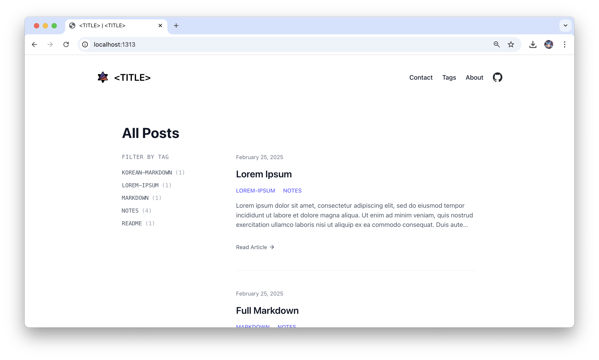
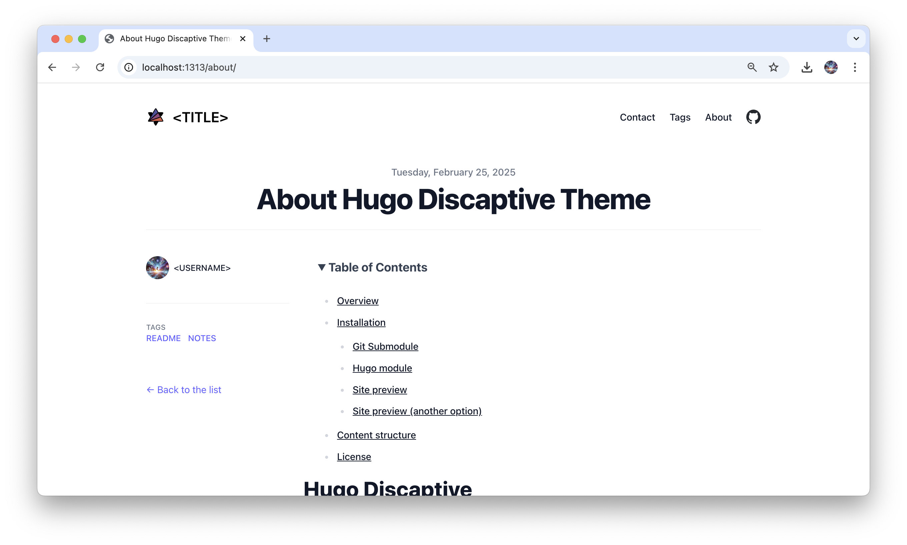
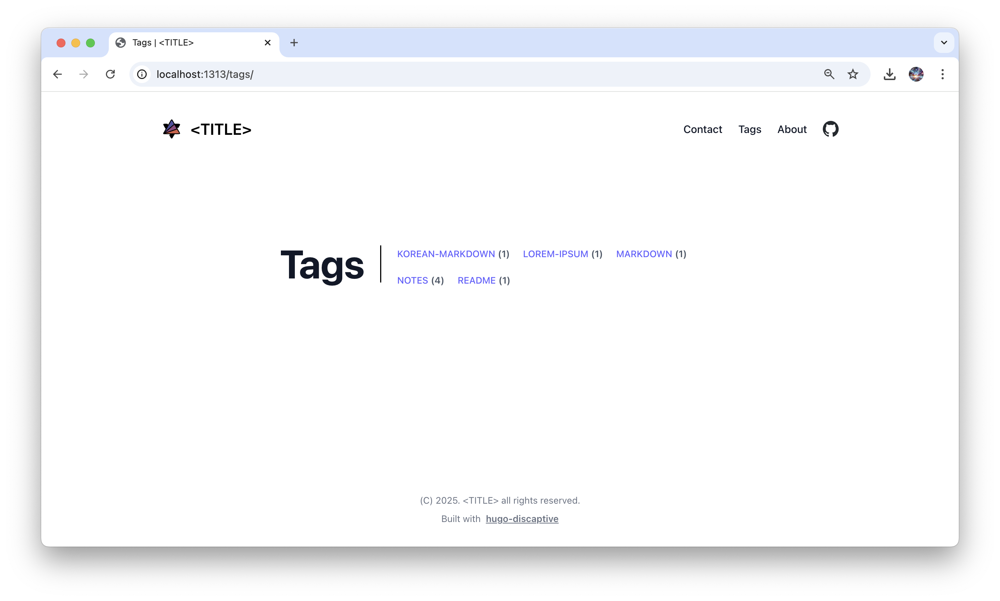

# Hugo Discaptive

A simple light theme that supports full responsive.

Inspired by [tailwind-nextjs-starter-blog](https://github.com/timlrx/tailwind-nextjs-starter-blog)

## Overview

In real usage: [discaptive.com](https://discaptive.com)







## Installation

Install Hugo and create a new site. See the Hugo documentation for details.

### Git Submodule

Before adding `hugo-discaptive` theme, initialize a Git repository.

    $ git init

Add `hugo-discaptive` as git submodule:

    $ git submodule add https://github.com/discaptive/hugo-discaptive.git themes/hugo-discaptive

### Hugo module

Initialize your site as hugo module:

    $ hugo mod init github.com/USERNAME/SITENAME

Add `hugo-discaptive` module as a dependency of your site:

    $ hugo mod get github.com/discaptive/hugo-discaptive

### Site preview

Copy the content of `exampleSite` at the root of your project:

    cp -r themes/hugo-discaptive/exampleSite/* .

If you installed `hugo-discaptive` as hugo module, set your theme in your config file (hugo.toml):

    [[module.imports]]
      path = "github.com/discaptive/hugo-discaptive"

Start Hugo:

    hugo serve

### Site preview (another option)

    $ cd themes/hugo-discaptive/exampleSite
    $ hugo server --theme ../..

## Content structure

```
content/
  ├── first-slug/
  │       ├── index.md
  │       ├── image1.jpg
  │       └── image1.png
  └── second-slug/
          ├── index.md
          ├── image1.jpg
          └── image1.png
```

## License

MIT Licensed, see [LICENSE](https://github.com/discaptive/hugo-discaptive/blob/main/LICENSE).
